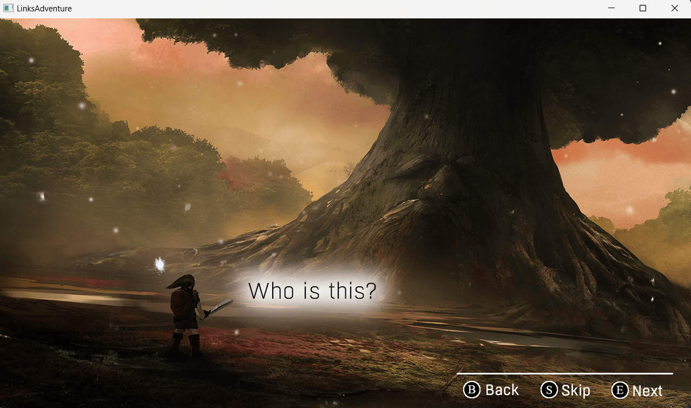

# Link's Adventure : A-Lone warrior

This is a 2D game where the main character's name is <b>Link</b>. There lived a princess name <b>Zendaya</b>. Once she was kidnapped by a <b>Wizard</b>. He captured her in a magical jail that can only be unlocked by the combination of <b>`3 keys`</b> which is in three different places of the jungle where the princess is captured. Moreover,to unlock the magical jail he has to collect all the soul of guards by defeating them. To complete the task he has only <b>`3 lives`, `5 bombs` and `1 sword`.</b> Can <b>Link</b> save the princess? 

## Game Menu 
In menu, there are `five` options. To select a option, you have to press `E` and for back pressing `B` is required.        

   

## Game Instruction
Here is described, which key performs which action.         
 

## Game Story

Here is the story of this game. A general overview and task is explained here. To `skip` this story, you have to press `S` and for going to next page, press `E`. For coming back to previous page, press `B`.       

## Game Play

### Game Interface     

Here are some pages of game play. In the first page we can see multiple guards. And at the bottom left corner we can see how many `Bombs` Link's have. At the bottom right, the `Heart` represent his lives and `White Ghost` icon represents number of defeated guards.        

### After explotion of bomb           

    

### After defeating all guards

### Ending Page

This page gives a hint of upcoming war.       

## Credits  

This whole game is developed by me(`S R Rayhan`) and my teammate `Avik Singha`.    

